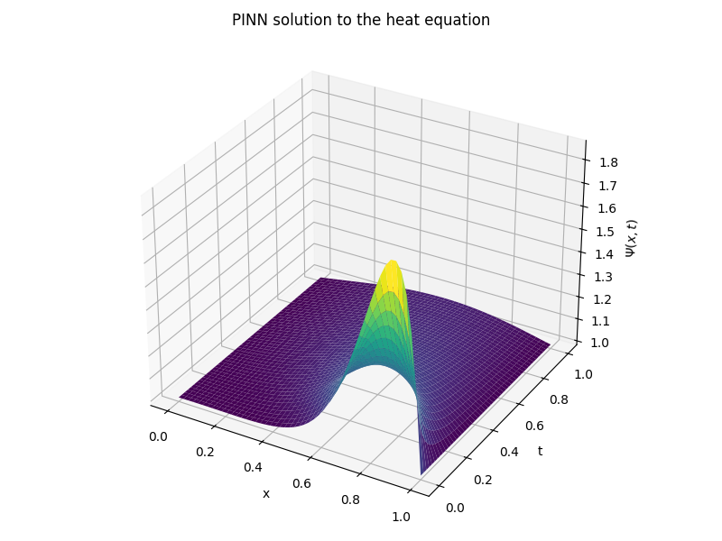
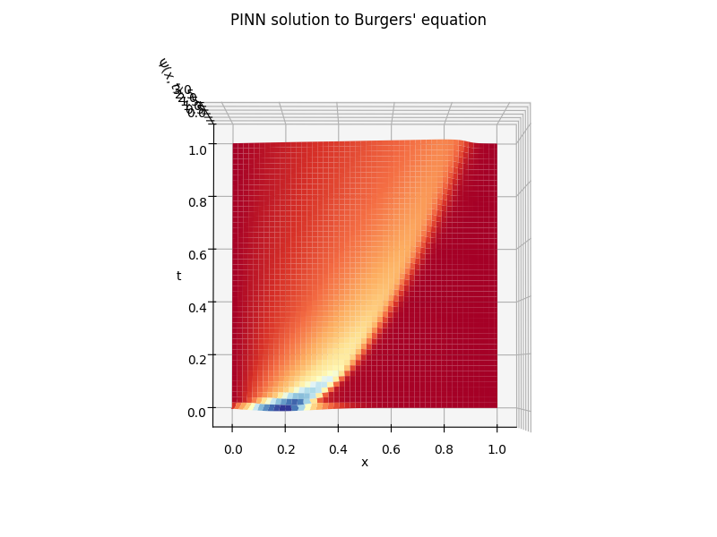

# pde-physics-informed-neural-networks

The following repository contains scripts for solving and validating complex ODE, heat, wave, transport, and Burgers' equations using physics-informed neural networks with PyTorch. Each PDE is 1D, but plotted for visualization with time and the scalar solution as separate axes for an overal 3D plot.

## Results

## Contents
[pinn_burgers_equation.py](#pinn_burgers_equationpy)  
[pinn_heat_equation.py](#pinn_heat_equationpy)     
[pinn_nonlin_secnd_ord_ODE.py](#pinn_nonlin_secnd_ord_ODEpy)  
[pinn_transport_equation.py](#pinn_transport_equationpy)  
[pinn_wave_equation.py](#pinn_wave_equationpy)  

## References
1. Hans & Bilionis (nanoHUB) – A Hands‑on Introduction to Physics‑Informed Neural Networks (course notes & code): https://proxy.nanohub.org/weber/2632895/HLzrXAHymks4BPpu/6/notebooks/PINNs_V1-1.ipynb?
2. freeCodeCamp.org (YouTube) - PyTorch for Deep Learning & Machine Learning – Full Course:
https://www.youtube.com/watch?v=V_xro1bcAuA
